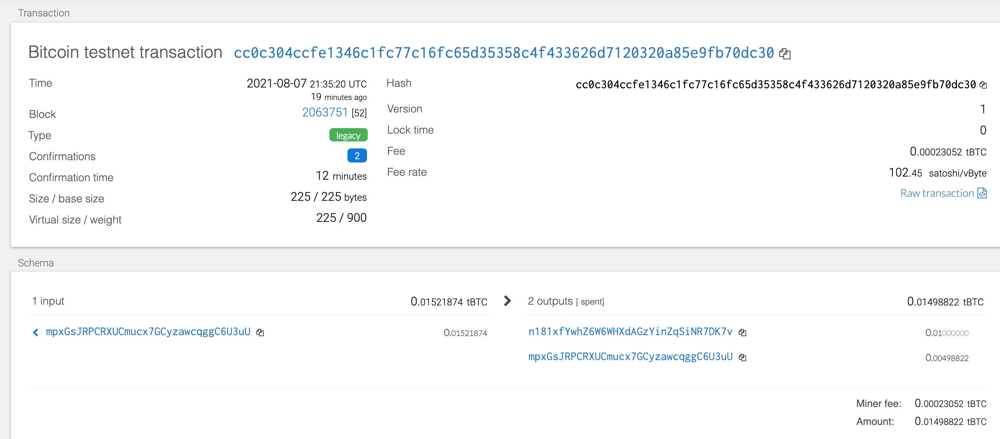

# HW-Multi-Blockchain-Wallet-Python

## Background
In this project we want to leverage how HD wallets work to create a multi-blockain wallet. Cryptocurrency/tokens share within investors portfolios is growing and the need to have a wallet able to read and transact 100s of coins became mandatory to be involved in this market. 

The dificulty on this exercise is to link your backend infrastratucture based on Python with the blockchain technology. IN this exercise we will show you how to integrate both. 
Once you've integrated this "universal" wallet, you can begin to manage billions of addresses across 300+ coins, giving
you a serious edge against the competition.

## Dependencies 
* PHP must be installed on your operating system (any version, 5 or 7).

* Clone the [hd-wallet-derive](https://github.com/dan-da/hd-wallet-derive). Follow the 
  * The hd-wallet-derive library is written in the PHP language; therefore, you will be required to first set up PHP on your machines before installing and then running the hd-wallet-derive library.

* bit Python Bitcoin library.

* web3.py Python Ethereum library.

## Instruction

1. Project setup 
Clone the hd-wallet-derive 
Create a symlink called derive for the hd-wallet-derive/hd-wallet-derive.php script. This will clean up the command needed to run the script in our code, as we can call ./derive instead of ./hd-wallet-derive/hd-wallet-derive.php 

1. Create your python code to derive your wallet addresses and to send transactions.

2. Send test transactions using either your cammand line or from your python notebook. To do so you need to store your code in both a notebook and a .py docuement.

### Wallet derive
Via your command line : 

Then run the command __python__ to open the Python shell.

Within the Python shell, run the command : __from wallet import *__. This will allow you to access the functions in wallet.py interactively.

Result of my wallet derive : 

## Bitcoin Testnet transaction
Remember you need to first fund your first addres using testnetfaucets. 

 __Bitcoin Testnet Transaction id :__  fa54fbg9d10f167f0f7590a62bf4c2e8f6b76a91310473a3117f21d52f5a3fddd

__BTC test address used to send the test transaction :__  mpxGsJRPCRXUC6mucx7GCyzawcqggC6U3uU
BTC test address 1 used to be teh recipient of the transaction : mpxGsJRPCR3XUCmucx7GCyzawcqggC6U3uU

__BTC Transaction ID :__  cc0c304ccfe1346c134fc77c16fc65d35358c4f433626d7120320a85e9fb70dc30

To find the transaction confirmation you can use any BTCTEST chain block explorer. We used : [Bitcoin testnet](https://tbtc.bitaps.com/)

 
## Local PoA Ethereum test transaction

You need to first launch your local network and fund one of the new addresses derived above as it will be teh first one you connect them to this network. 

__ETH address used to send the test 
transaction :__  0xf46e2491686bF2E1591865Fc316dee66f600446f26

__ETH address used to be the recipient of the transaction :__  0xf340f4ffa2cd566f382dc39c67307bf1ace8d32816775de7115433e123bfc4f2

__Transaction ID :__  0x1877b7737cb92e8ce92e6615d34e6aa5a37555ce8373bb07345cdcda7bd1dbcbf

To confirm the transaction we did both - checked the transaction in MyCrypto application and checked the balance via python code. 

